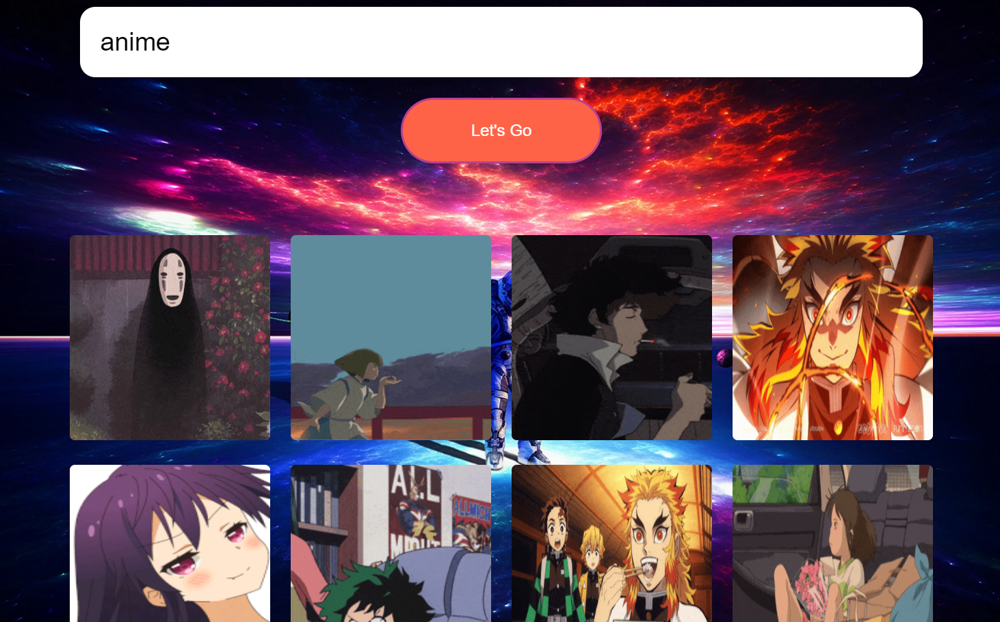

[![Contributors][contributors-shield]][contributors-url]
[![Forks][forks-shield]][forks-url]
[![Stargazers][stars-shield]][stars-url]
[![Issues][issues-shield]][issues-url]
[![LinkedIn][linkedin-shield]][linkedin-url]

<!-- PROJECT LOGO -->
<br />
<p align="center">
  <a href="https://github.com/ParitoshPC/GiphyAPI">
    <h1 align="center">🏢</h1>
  </a>

  <h3 align="center">Giphy Search Engine</h3>

  <p align="center">
    This Project is about fetching Gifs from <a href="https://developers.giphy.com/docs/api/">GiphyAPI</a>
    <br />
    <a href="https://github.com/ParitoshPC/GiphyAPI"><strong>Explore the docs »</strong></a>
    <br />
    <br />
    <a href="https://github.com/ParitoshPC/GiphyAPI">View Demo</a>
    ·
    <a href="https://github.com/ParitoshPC/GiphyAPI/issues">Report Bug</a>
    ·
    <a href="https://github.com/ParitoshPC/GiphyAPI/issues">Request Feature</a>
  </p>
</p>

<!-- TABLE OF CONTENTS -->
<details open="open">
  <summary><h2 style="display: inline-block">Table of Contents</h2></summary>
  <ol>
    <li>
      <a href="#about-the-project">About The Project</a>
      <ul>
        <li><a href="#built-with">Built With</a></li>
      </ul>
    </li>
    <li>
      <a href="#getting-started">Getting Started</a>
      <ul>
        <li><a href="#prerequisites">Prerequisites</a></li>
        <li><a href="#installation">Installation</a></li>
      </ul>
    </li>

  </ol>
</details>

<!-- ABOUT THE PROJECT -->

## About The Project

### Built With


- [HTML](https://www.w3schools.com/html/)
- [CSS](https://www.w3schools.com/css/)
- [Javascript](https://developer.mozilla.org/en-US/docs/Web/JavaScript)
- [Giphy](https://developers.giphy.com/docs/api/)

### Project Screenshot



<!-- GETTING STARTED -->

## Getting Started

To get a local copy up and running follow these simple steps.

### Prerequisites

All you need is the basic knowledge and clear understanding of all the topics

- HTML
- CSS
- Javascript

### Installation

1. Get a free API key at https://developers.giphy.com/dashboard/

2. Clone the repo
   ```sh
   git clone https://github.com/ParitoshPC/GiphyAPI.git
   ```
3. Take some reference from the project. Write some code :scream: :sunglasses:

4. All set. Fewwww!!! This is so hard!! :smile: :bowtie:

<!-- CONTRIBUTING -->

## Contributing

Contributions are what make the open source community such an amazing place to be learn, inspire, and create. Any contributions you make are **greatly appreciated**.

1. Fork the Project
2. Create your Feature Branch (`git checkout -b feature/AmazingFeature`)
3. Commit your Changes (`git commit -m 'Add some AmazingFeature'`)
4. Push to the Branch (`git push origin feature/AmazingFeature`)
5. Open a Pull Request

<!-- CONTACT -->

## Contact

Paritosh Chauhan - [@paritosh1231](https://twitter.com/paritosh1231) - paritoshchauhan1202@gmail.com

Project Link: [https://github.com/ParitoshPC/GiphyAPI](https://paritoshpc.github.io/GiphyAPI/)

<!-- ACKNOWLEDGEMENTS -->

## Acknowledgements

- [GitHub Emoji Cheat Sheet](https://www.webfx.com/tools/emoji-cheat-sheet/)
- [GitHub Pages](https://pages.github.com/)

<!-- MARKDOWN LINKS & IMAGES -->
<!-- https://www.markdownguide.org/basic-syntax/#reference-style-links -->

[contributors-shield]: https://img.shields.io/github/contributors/ParitoshPC/GiphyAPI.svg?style=for-the-badge
[contributors-url]: https://github.com/ParitoshPC/GiphyAPI/graphs/contributors
[forks-shield]: https://img.shields.io/github/forks/ParitoshPC/GiphyAPI.svg?style=for-the-badge
[forks-url]: https://github.com/ParitoshPC/GiphyAPI/network/members
[stars-shield]: https://img.shields.io/github/stars/ParitoshPC/GiphyAPI.svg?style=for-the-badge
[stars-url]: https://github.com/ParitoshPC/GiphyAPI/stargazers
[issues-shield]: https://img.shields.io/github/issues/ParitoshPC/GiphyAPI.svg?style=for-the-badge
[issues-url]: https://github.com/ParitoshPC/GiphyAPI/issues
[linkedin-shield]: https://img.shields.io/badge/-LinkedIn-black.svg?style=for-the-badge&logo=linkedin&colorB=555
[linkedin-url]: https://in.linkedin.com/in/paritosh-chauhan-3827711a7
